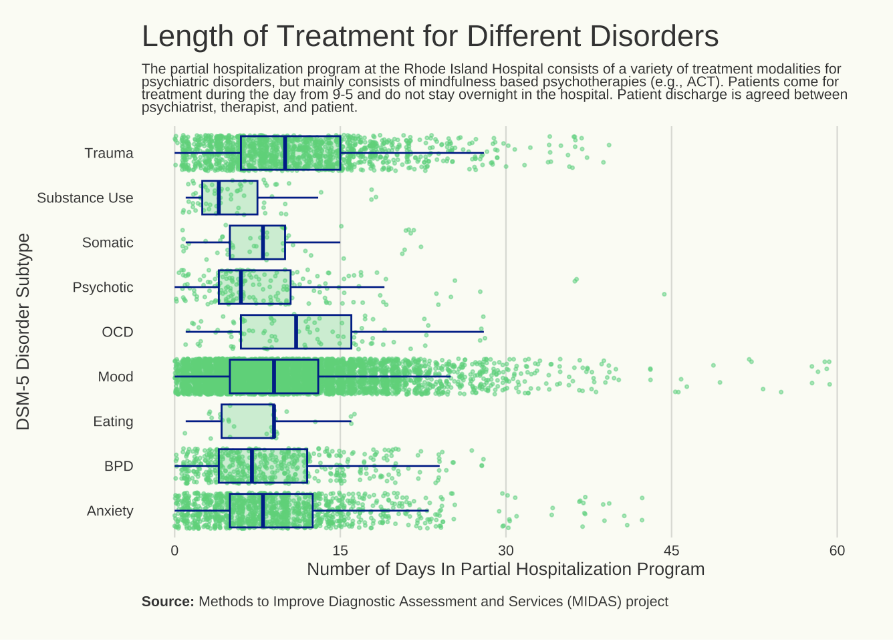
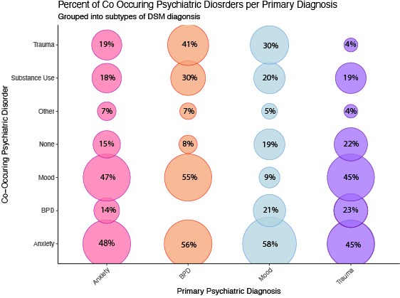
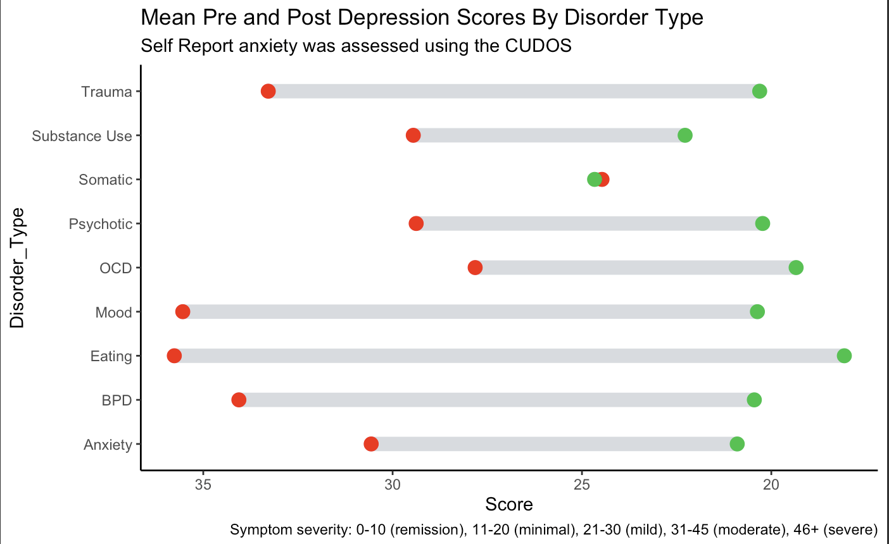

```{r setup, include=FALSE}
knitr::opts_chunk$set(echo = TRUE)
```

## Visualizing Mental Health Treatment.

This is a series of R Markdowns dipicting code used for a final project in a Design for Data Visualization course BMI 787. 

---

## Background on project:

#### Partial hospitalization is a useful and effective treatment option for mental health

- Partial hospitalization refers to intensive mental health treatment that is considered a higher level of care than outpatient weekly therapy, but a lower level of care than inpatient treatment.
- Partial hospital programs generally involve daily therapy in different forms for about half a day, before patients return home to practice skills used in therapy in their lives.
-Empirical evidence shows that these programs are effective in reducing symptoms of common mental health conditions (Price, 2022; Murphy et al., 2022).


#### Partial hospitalization settings are understudied in the field of clinical psychology

- Despite their usefulness and relative ubiquity, relatively little research is conducted or reported in partial hospital program patients, leaving providers in this setting without a solid empirical basis from which to draw (Morgan et al., 2021).
- Therefore, the purpose of this project is to help fill this gap in research by visualizing demographic and clinical variables from a partial hospitalization program. 
    + Who attends this program?
    + Do patients improve during treatment? Which patients? On what measures?
    + At what point in treatment do patients improve?
    

#### Data for this project comes from a longstanding partial hospital program at a public hospital in New England

- Data comes from the Methods to Improve Diagnostic Assessment and Services (MIDAS) project – a longitudinal project that collects psychiatric patient data from outpatient and partial hospital settings.
- Patients at the partial hospital program attend multiple group therapies each day, as well as individual meeting with a therapist and psychiatrist. 
- Treatment is based in Acceptance and Commitment Therapy (ACT), an empirically-supported psychotherapy (Hayes et al., 2006).

#### The following visualizations are broken up into 4 sections:

1. [Sociodemographic and Treatment Characteristics](https://troy-hubert.github.io/Hospital_Visualizations/Data_Import.html)
2. [Diagnosis Visualizations](https://troy-hubert.github.io/Hospital_Visualizations/Diagnosis_Vis.html)
3. [Treatment Progression Visualizations](https://troy-hubert.github.io/Hospital_Visualizations/Anxiety_Vis.html)
4. [Treatment Outcome Visualization](https://troy-hubert.github.io/Hospital_Visualizations/Treatment_Outcomes.html)


#### Enjoy my favorite visualizations from the project!








---
### References

Hayes, S. C., Luoma, J. B., Bond, F. W., Masuda, A., & Lillis, J. (2006). Acceptance and commitment therapy: model, processes and outcomes. Behaviour research and therapy, 44(1), 1–25. https://doi.org/10.1016/j.brat.2005.06.006

Price, C. M. (2022). Participants’ experiences of group therapy in a partial hospitalization program: “It was impactful” ProQuest Information & Learning. In Dissertation Abstracts International Section A: Humanities and Social Sciences (Vol. 83, Issue 8–A).

Morgan, T. A., Dalrymple, K., D’Avanzato, C., Zimage, S., Balling, C., Ward, M., & Zimmerman, M. (2021). Conducting outcomes research in a clinical practice setting: 
The effectiveness and acceptability of acceptance and commitment therapy (ACT) in a partial hospital program. Behavior Therapy, 52(2), 272–285. https://doi-org.ezproxy.uky.edu/10.1016/j.beth.2020.08.004

Murphy, J. W., Corey, L. C., & Sturgeon, M. J. (2022). Evaluation of outcomes for military mental health partial hospitalization program. Military Psychology, 34(1), 91–97. https://doi-org.ezproxy.uky.edu/10.1080/08995605.2021.1971939
